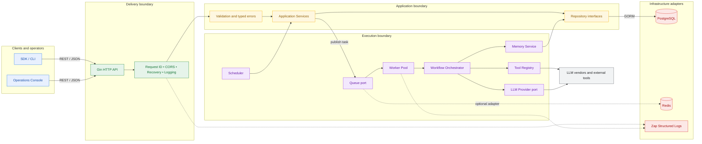
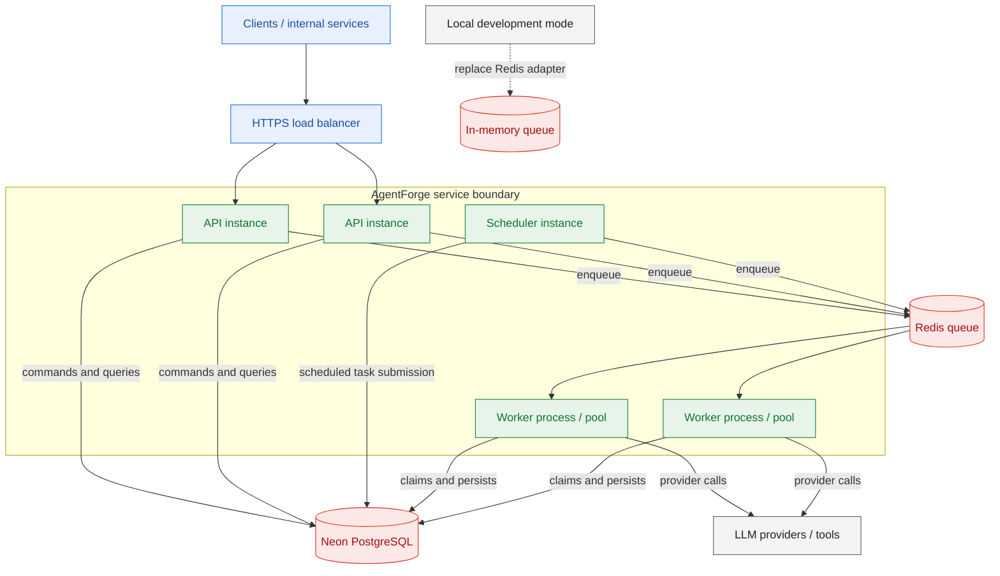

# System Architecture

## Logical architecture

The system is organized into four boundaries: delivery, application, execution, and infrastructure. Arrows represent dependency direction; the domain does not depend on adapters.



## Runtime and deployment topology

The first deployment can run as one Go service with an in-memory queue. The interfaces preserve the path to a horizontally scaled API/worker deployment with Redis-backed coordination.



## Request and data flow

1. The load balancer terminates TLS and forwards requests to an API instance.
2. Middleware assigns a request ID, recovers panics, applies CORS policy, and emits structured access logs.
3. Application services validate commands and execute repository operations inside explicit transactions.
4. Task submission writes the durable task record before publishing work. A recovery/reconciliation process can identify persisted pending tasks that were not published.
5. Workers claim work, execute steps with bounded concurrency and context deadlines, then persist outputs and logs.
6. Reads use PostgreSQL as the source of truth. Redis may cache hot data or coordinate distributed queue consumption.

## Scalability and failure model

| Concern | Strategy |
| --- | --- |
| API scale | Stateless API instances behind a load balancer |
| Worker scale | Increase worker replicas and configure per-process pool size |
| Queue durability | Start in-memory; use Redis or a durable broker for multi-instance deployments |
| Database pressure | Connection pooling, indexed task queries, bounded worker concurrency |
| Provider slowness | Context deadlines, retry budgets, circuit-breaking at the provider adapter |
| Process failure | At-least-once delivery with task claim/lease and idempotent transitions |
| Shutdown | Stop intake, drain or cancel workers, close queue and database resources |
| Observability | Correlated structured logs, task logs, latency, status, and worker identity |

## Package mapping

```text
cmd/server          composition root and process lifecycle
internal/api         HTTP handlers, routes, request/response DTOs
internal/agent       agent domain and service
internal/workflow    workflow and step domain
internal/worker      worker pool, retries, claims, shutdown
internal/queue       queue interface and adapters
internal/scheduler   cron scheduling and task submission
internal/memory      persistent memory service
internal/tools       tool interface and registry
internal/llm         LLM provider interface and adapters
internal/repository  persistence interfaces and GORM implementations
internal/database    PostgreSQL connection and transactions
internal/models      persistence models
internal/middleware  cross-cutting HTTP concerns
internal/config      environment-backed configuration
internal/logger      Zap construction and fields
```
