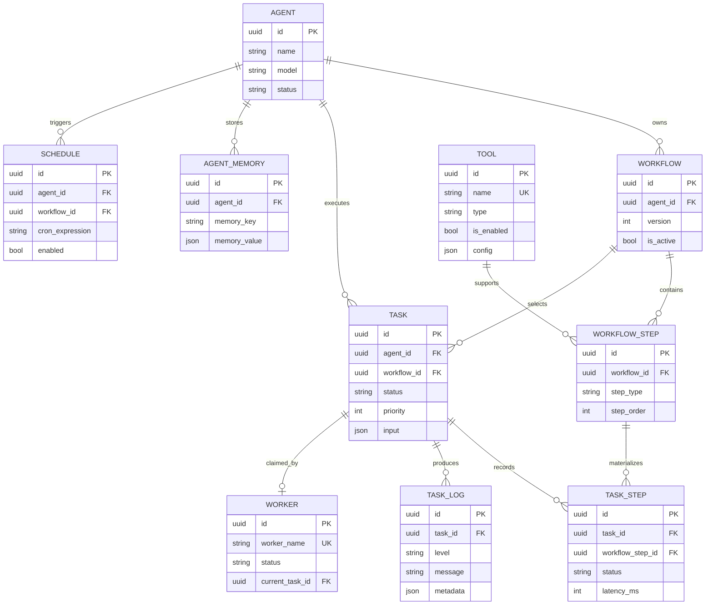

# System Design

## Purpose

This document describes AgentForge as a durable execution platform for autonomous AI agents. The design treats an agent run as a task with observable state, not as a synchronous chat request.

## Design goals

- Execute thousands of concurrent tasks with bounded worker resources.
- Persist task, workflow, memory, and audit state in PostgreSQL.
- Keep business logic independent of transport, storage, queue, and model vendors.
- Support retries, cancellation, graceful shutdown, and structured observability.
- Allow the initial in-memory queue to be replaced by Redis, NATS, RabbitMQ, or Kafka.

## Domain model

The core aggregate relationships are:



PostgreSQL owns durable state. `tasks` and `task_steps` are the execution record; `task_logs` is the append-oriented operational history. Foreign keys protect lifecycle integrity when agents, workflows, or tasks are removed.

## Task execution lifecycle

```mermaid
sequenceDiagram
    autonumber
    participant C as Client
    participant API as HTTP API
    participant S as Task Service
    participant DB as PostgreSQL
    participant Q as Queue
    participant W as Worker Pool
    participant R as Tool/LLM Runtime

    C->>API: POST /v1/tasks
    API->>S: Validate and submit command
    S->>DB: Transaction: create task (pending)
    S->>Q: Publish task ID and priority
    S-->>API: Task reference
    API-->>C: 202 Accepted
    W->>Q: Claim next task
    W->>DB: Mark running; create task-step record
    W->>R: Execute step with context and timeout
    R-->>W: Result or typed error
    W->>DB: Persist step result and task status
    W->>DB: Append structured task log
    C->>API: GET /v1/tasks/{taskID}
    API->>DB: Read task projection
    DB-->>API: Status, output, error
    API-->>C: 200 OK
```

The API acknowledges accepted work quickly. Workers own execution and state transitions. Every transition must be idempotent or protected by a claim/lease rule so a retry cannot produce an invalid terminal state.

## Boundaries and interfaces

| Boundary | Responsibility | Replaceable dependency |
| --- | --- | --- |
| Domain | Agent, workflow, task, step, memory rules | None |
| Application services | Commands, queries, transactions, orchestration | Repositories and ports |
| Queue port | Publish and consume task messages | In-memory, Redis, NATS, RabbitMQ, Kafka |
| Worker runtime | Concurrency, retry, cancellation, shutdown | Queue and execution ports |
| Tool registry | Resolve and invoke named tools | Tool implementations |
| LLM port | Generate model output | OpenAI, Gemini, Anthropic, Ollama, mock |
| Repository port | Durable reads and writes | GORM/PostgreSQL implementation |
| Delivery | HTTP routing, validation, serialization | Gin |

## Reliability decisions

- A task starts as `pending`, becomes `running` after a worker claim, and ends in `completed`, `failed`, or `cancelled`.
- Retry policy belongs to the worker/application boundary, not to a specific tool or HTTP handler.
- Context cancellation propagates from shutdown or task cancellation into each step and provider call.
- Queue delivery is treated as at-least-once; task execution therefore requires idempotency.
- PostgreSQL transactions cover coupled state changes such as task creation and task-step materialization.
- Redis is an acceleration and coordination layer, not the authoritative source of task history.

## Security and governance

Credentials belong in environment or secret-manager configuration, never in agent or tool payloads. API authentication, authorization, rate limiting, and tenant isolation should be added at the delivery boundary before exposing the service publicly. Tool configuration must be validated and access-controlled because tools are an execution boundary.
